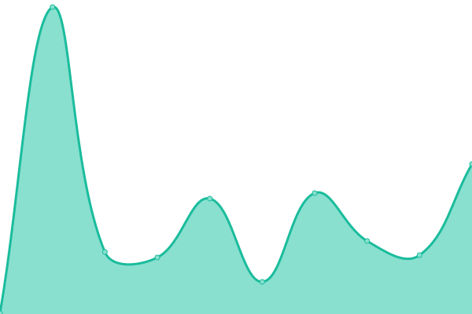
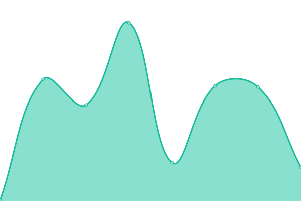

# [📈 Live Status](https://centralplus-io.github.io/status-centralplus-io): <!--live status--> **🟩 All systems operational**

This repository contains the open-source uptime monitor and status page for [Central](https://app.centralplus.io), powered by [Upptime](https://github.com/upptime/upptime).

With [Upptime](https://upptime.js.org), you can get your own unlimited and free uptime monitor and status page, powered entirely by a GitHub repository. We use [Issues](https://github.com/centralplus-io/status-centralplus-io/issues) as incident reports, [Actions](https://github.com/centralplus-io/status-centralplus-io/actions) as uptime monitors, and [Pages](https://centralplus-io.github.io/status-centralplus-io) for the status page.

<!--start: status pages-->
<!-- This summary is generated by Upptime (https://github.com/upptime/upptime) -->
<!-- Do not edit this manually, your changes will be overwritten -->
<!-- prettier-ignore -->
| URL | Status | History | Response Time | Uptime |
| --- | ------ | ------- | ------------- | ------ |
|  [Api](https:/api.centralplus.io) | 🟩 Up | [api.yml](https://github.com/centraldevelopers/status-centralplus-io/commits/HEAD/history/api.yml) | 

 286ms
     
 | 

<a href="https://centraldevelopers.github.io/status-centralplus-io/history/api">100.00%</a>
    

|  [App](https://app.centralplus.io) | 🟩 Up | [app.yml](https://github.com/centraldevelopers/status-centralplus-io/commits/HEAD/history/app.yml) | 

 167ms
     
 | 

<a href="https://centraldevelopers.github.io/status-centralplus-io/history/app">100.00%</a>
    

|  [Admin](https://admin.centralplus.io) | 🟩 Up | [admin.yml](https://github.com/centraldevelopers/status-centralplus-io/commits/HEAD/history/admin.yml) | 

 160ms
     
 | 

<a href="https://centraldevelopers.github.io/status-centralplus-io/history/admin">100.00%</a>
    

|  [Admin v2](http://cp.admin.v2.prod.s3-website-us-east-1.amazonaws.com) | 🟩 Up | [admin-v2.yml](https://github.com/centraldevelopers/status-centralplus-io/commits/HEAD/history/admin-v2.yml) | 

 198ms
     
 | 

<a href="https://centraldevelopers.github.io/status-centralplus-io/history/admin-v2">100.00%</a>
    

<!--end: status pages-->

[**Visit our status website →**](https://centralplus-io.github.io/status-centralplus-io)

## 📄 License

- Powered by: [Upptime](https://github.com/upptime/upptime)
- Code: [MIT](./LICENSE) © [Central](https://app.centralplus.io)
- Data in the `./history` directory: [Open Database License](https://opendatacommons.org/licenses/odbl/1-0/)
