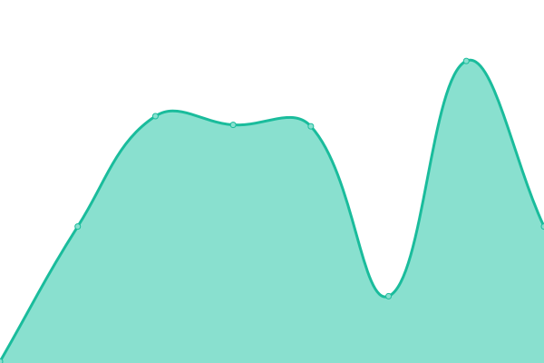
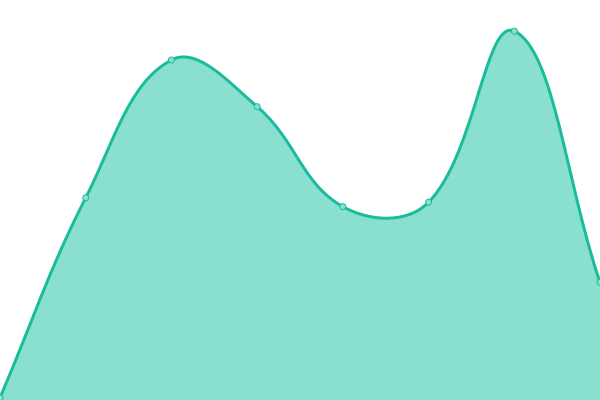
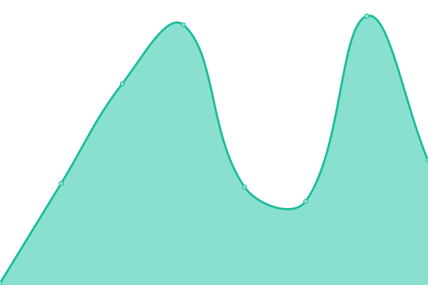

# [📈 Live Status](https://centralplus-io.github.io/status-centralplus-io): <!--live status--> **🟧 Partial outage**

This repository contains the open-source uptime monitor and status page for [Central](https://app.centralplus.io), powered by [Upptime](https://github.com/upptime/upptime).

With [Upptime](https://upptime.js.org), you can get your own unlimited and free uptime monitor and status page, powered entirely by a GitHub repository. We use [Issues](https://github.com/centralplus-io/status-centralplus-io/issues) as incident reports, [Actions](https://github.com/centralplus-io/status-centralplus-io/actions) as uptime monitors, and [Pages](https://centralplus-io.github.io/status-centralplus-io) for the status page.

<!--start: status pages-->
<!-- This summary is generated by Upptime (https://github.com/upptime/upptime) -->
<!-- Do not edit this manually, your changes will be overwritten -->
<!-- prettier-ignore -->
| URL | Status | History | Response Time | Uptime |
| --- | ------ | ------- | ------------- | ------ |
|  [API::PRODUCTION](https:/api.centralplus.io) | 🟩 Up | [api-production.yml](https://github.com/centraldevelopers/status-centralplus-io/commits/HEAD/history/api-production.yml) | 

 305ms
     
 | 

<a href="https://status.centralplus.io/history/api-production">100.00%</a>
    

|  [API::BETA](https:/api-beta.centralplus.io) | 🟩 Up | [api-beta.yml](https://github.com/centraldevelopers/status-centralplus-io/commits/HEAD/history/api-beta.yml) | 

 274ms
     
 | 

<a href="https://status.centralplus.io/history/api-beta">100.00%</a>
    

|  [API::ALPHA](https:/api-alpha.centralplus.io) | 🟥 Down | [api-alpha.yml](https://github.com/centraldevelopers/status-centralplus-io/commits/HEAD/history/api-alpha.yml) | 

 0ms
     
 | 

<a href="https://status.centralplus.io/history/api-alpha">0.00%</a>
    

|  [APP::PRODUCTION](https://app.centralplus.io) | 🟥 Down | [app-production.yml](https://github.com/centraldevelopers/status-centralplus-io/commits/HEAD/history/app-production.yml) | 

 0ms
     
 | 

<a href="https://status.centralplus.io/history/app-production">0.00%</a>
    

|  [APP::BETA](http://cp.app.beta.s3-website-us-east-1.amazonaws.com/) | 🟩 Up | [app-beta.yml](https://github.com/centraldevelopers/status-centralplus-io/commits/HEAD/history/app-beta.yml) | 

 152ms
     
 | 

<a href="https://status.centralplus.io/history/app-beta">100.00%</a>
    

|  [APP::ALPHA](http://cp.app.alpha.s3-website-us-east-1.amazonaws.com/) | 🟩 Up | [app-alpha.yml](https://github.com/centraldevelopers/status-centralplus-io/commits/HEAD/history/app-alpha.yml) | 

 158ms
     
 | 

<a href="https://status.centralplus.io/history/app-alpha">100.00%</a>
    

|  [ADMIN::PRODUCTION](http://cp.app.prod.s3-website-us-east-1.amazonaws.com/) | 🟩 Up | [admin-production.yml](https://github.com/centraldevelopers/status-centralplus-io/commits/HEAD/history/admin-production.yml) | 

 150ms
     
 | 

<a href="https://status.centralplus.io/history/admin-production">100.00%</a>
    

|  [ADMIN::BETA](http://cp.admin.beta.s3-website-us-east-1.amazonaws.com/) | 🟩 Up | [admin-beta.yml](https://github.com/centraldevelopers/status-centralplus-io/commits/HEAD/history/admin-beta.yml) | 

 158ms
     
 | 

<a href="https://status.centralplus.io/history/admin-beta">100.00%</a>
    

|  [ADMIN::ALPHA](http://cp.admin.alpha.s3-website-us-east-1.amazonaws.com/) | 🟩 Up | [admin-alpha.yml](https://github.com/centraldevelopers/status-centralplus-io/commits/HEAD/history/admin-alpha.yml) | 

 145ms
     
 | 

<a href="https://status.centralplus.io/history/admin-alpha">100.00%</a>
    

|  [ADMIN v2::PRODUCTION](https://admin.centralplus.io) | 🟥 Down | [admin-v2-production.yml](https://github.com/centraldevelopers/status-centralplus-io/commits/HEAD/history/admin-v2-production.yml) | 

 0ms
     
 | 

<a href="https://status.centralplus.io/history/admin-v2-production">0.00%</a>
    

|  [ADMIN v2::BETA](http://cp.admin.v2.beta.s3-website-us-east-1.amazonaws.com/) | 🟩 Up | [admin-v2-beta.yml](https://github.com/centraldevelopers/status-centralplus-io/commits/HEAD/history/admin-v2-beta.yml) | 

 126ms
     
 | 

<a href="https://status.centralplus.io/history/admin-v2-beta">100.00%</a>
    

|  [ADMIN v2::ALPHA](http://cp.admin.v2.alpha.s3-website-us-east-1.amazonaws.com/) | 🟩 Up | [admin-v2-alpha.yml](https://github.com/centraldevelopers/status-centralplus-io/commits/HEAD/history/admin-v2-alpha.yml) | 

 137ms
     
 | 

<a href="https://status.centralplus.io/history/admin-v2-alpha">100.00%</a>
    

<!--end: status pages-->

[**Visit our status website →**](https://centralplus-io.github.io/status-centralplus-io)

## 📄 License

- Powered by: [Upptime](https://github.com/upptime/upptime)
- Code: [MIT](./LICENSE) © [Central](https://app.centralplus.io)
- Data in the `./history` directory: [Open Database License](https://opendatacommons.org/licenses/odbl/1-0/)
